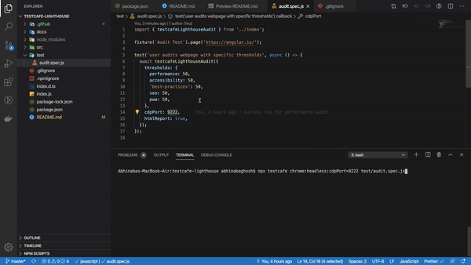

## Lighthouse Testcafe - NPM Package

[](https://www.npmjs.com/package/testcafe-lighthouse)

[Lighthouse](https://developers.google.com/web/tools/lighthouse) is a tool developed by Google that analyzes web apps and web pages, collecting modern performance metrics and insights on developer best practices.

The purpose of this package is to produce performance report for several pages in connected mode and in an automated (programmatic) way.

## Usage

### Installation

You can have to add the `testcafe-lighthouse` library as a dependency (or dev-dependency) in your project

```sh
$ yarn add -D testcafe-lighthouse
# or
$ npm install --save-dev testcafe-lighthouse
```

### In your code

After completion of the Installation, you can use `testcafe-lighthouse` in your code to audit the current page.

**_Step 1:_**
In your test code you need to import `testcafe-lighthouse` and assign a `cdpPort` for the lighthouse scan. You can choose any non-allocated port.

```js
import { testcafeAudit } from 'testcafe-lighthouse';

fixture(`Audit Test`).page('http://localhost:3000/login');

test('user performs lighthouse audit', async (t) => {
  const currentURL = await t.eval(() => document.documentURI);
  await testcafeAudit({
    url: currentURL,
    cdpPort: 9222,
  });
});
```

**_Step 2:_**
Kick start test execution with the same `cdpPort`.

```ssh
// headless mode, preferable for CI
npx testcafe chrome:headless:cdpPort=9222 test.js

// non headless mode
npx testcafe 'chrome:emulation:cdpPort=9222'  test.js
```

## Thresholds per tests

If you don't provide any threshold argument to the `testcafeAudit` command, the test will fail if at least one of your metrics is under `100`.

You can make assumptions on the different metrics by passing an object as argument to the `testcafeAudit` command:

```javascript
import { testcafeAudit } from 'testcafe-lighthouse';

fixture(`Audit Test`).page('https://angular.io/');

test('user page performance with specific thresholds', async (t) => {
  const currentURL = await t.eval(() => document.documentURI);
  await testcafeAudit({
    url: currentURL,
    thresholds: {
      performance: 50,
      accessibility: 50,
      'best-practices': 50,
      seo: 50,
      pwa: 50,
    },
    cdpPort: 9222,
  });
});
```

If the Lighthouse analysis returns scores that are under the one set in arguments, the test will fail.

You can also make assumptions only on certain metrics. For example, the following test will **only** verify the "correctness" of the `performance` metric:

```javascript
test('user page performance with specific thresholds', async (t) => {
  const currentURL = await t.eval(() => document.documentURI);
  await testcafeAudit({
    url: currentURL,
    thresholds: {
      performance: 85,
    },
    cdpPort: 9222,
  });
});
```

This test will fail only when the `performance` metric provided by Lighthouse will be under `85`.

## Passing different Lighthouse config to testcafe-lighthouse directly

You can also pass any argument directly to the Lighthouse module using the second and third options of the command:

```js
const thresholdsConfig = {
  /* ... */
};

const lighthouseOptions = {
  /* ... your lighthouse options */
};

const lighthouseConfig = {
  /* ... your lighthouse configs */
};

await testcafeAudit({
  thresholds: thresholdsConfig,
  opts: lighthouseOptions,
  config: lighthouseConfig,

  /* ... other configurations */
});
```

## Generating audit reports

`testcafe-lighthouse` library can produce Lighthouse CSV, HTML and JSON audit reports, that you can host in your CI server. These reports can be useful for ongoing audits and monitoring from build to build.

```js
await testcafeAudit({
  /* ... other configurations */

  reports: {
    formats: {
      /* you can any of them or combination of them */
      json: true, //defaults to false
      html: true, //defaults to false
      csv: true, //defaults to false
    },
    name: `name-of-the-report`, //defaults to `lighthouse-${new Date().getTime()}`
    directory: `path/to/directory`, //defaults to `${process.cwd()}/lighthouse`
  },
});
```

This will result in below HTML report


## Sample Tests

You can find sample tests [here](./test)

## Demo



## Tell me your issues

you can raise any issue [here](https://github.com/abhinaba-ghosh/testcafe-lighthouse/issues)

## Before you go

If it works for you , give a [Star](https://github.com/abhinaba-ghosh/testcafe-lighthouse)! :star:

_- Copyright &copy; 2020- [Abhinaba Ghosh](https://www.linkedin.com/in/abhinaba-ghosh-9a2ab8a0/)_
